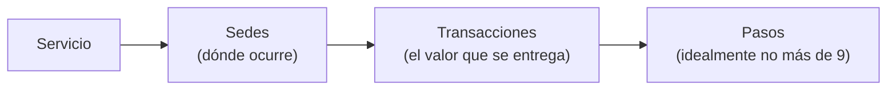
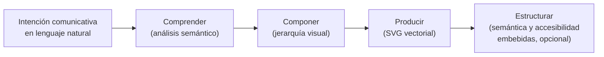

# Accesibilidad cognitiva en los servicios públicos

Guion y esquema para presentación de 15 minutos
Secretaría Regional Ministerial de Educación, Viña del Mar
Herbert Spencer — e[ad] PUCV / PICTOS

## Idea central

Una sola tesis atraviesa los 15 minutos: **la accesibilidad no es una rampa para unos pocos, es claridad para todos**. La Ley 21.545 obliga a realizar los ajustes necesarios para que las personas accedan en igualdad de condiciones[^1], pero cumplir la ley es solo el punto de partida: el diseño puede transformar esa obligación en calidad de servicio para toda la ciudadanía. La presentación recorre el argumento desde la visión (por qué), pasando por los principios (qué), hasta las herramientas (cómo), y cierra con dos demos en vivo.

## Esquema general y minutaje

| Bloque | Contenido | Tiempo | Acumulado |
|---|---|---|---|
| 1 | Apertura: el trámite como frontera | 1 min | 0:00 – 1:00 |
| 2 | La visión del diseño sobre la accesibilidad | 2 min | 1:00 – 3:00 |
| 3 | Principios de un servicio accesible | 3 min | 3:00 – 6:00 |
| 4 | El rol de los apoyos visuales | 3 min | 6:00 – 9:00 |
| 5 | Parte práctica: herramientas y demos en vivo | 5 min | 9:00 – 14:00 |
| 6 | Cierre: la accesibilidad como principio democrático | 1 min | 14:00 – 15:00 |

## Bloque 1 — Apertura: el trámite como frontera (1 min)

**En pantalla:** título de la charla y una sola pregunta: "¿Cuántas personas entienden, de verdad, lo que les pedimos hacer?"

**Guion hablado:**

Todos los que trabajamos en servicios públicos atendemos a un público que no elegimos: llega toda la diversidad humana, con todas sus formas de comprender. Cuando una persona no entiende un trámite, no accede al valor del servicio: el derecho existe en el papel, pero no en la experiencia. Quiero mostrarles en 15 minutos cómo el diseño puede cerrar esa brecha, y dejarles herramientas concretas —todas chilenas y de código abierto— para empezar mañana.

**Nota de ritmo:** no presentarse en extenso aquí; la credencial aparece sola en el bloque 5 cuando se cuenta el origen de PICTOS.

## Bloque 2 — La visión del diseño sobre la accesibilidad (2 min)

**En pantalla:** definición breve de accesibilidad cognitiva y las tres leyes (20.422, 21.545, 21.180).

**Guion hablado:**

La accesibilidad cognitiva es el grado en que las personas pueden percibir, comprender e interactuar significativamente con la información, los procesos y los entornos, independiente de sus capacidades cognitivas[^2]. Tres ideas de la visión del diseño:

Primera: la accesibilidad no es una característica del usuario, es una característica de la relación entre el servicio y la persona. No hay "personas incapaces de entender"; hay servicios que no se dejan entender.

Segunda: el marco legal chileno ya lo exige. La Ley 20.422 estableció los ajustes razonables como derecho; la Ley 21.545 los hace exigibles para las personas del espectro autista en lo social, la salud y la educación; y la Ley 21.180 de Transformación Digital obliga a explicitar y estandarizar todos los procedimientos administrativos[^1]. Las tres leyes convergen en lo mismo: hacer visible y comprensible lo que el Estado hace.

Tercera —y esta es la clave del diseño—: subir el estándar de claridad beneficia a todos. Lo que es necesario para algunos resulta útil para todos: el adulto mayor, el migrante, la persona apurada o con estrés. La accesibilidad cognitiva no es un gesto altruista, es una mejora estratégica de la calidad del servicio.

## Bloque 3 — Principios de un servicio accesible (3 min)

**En pantalla:** esquema de anatomía de un servicio y los tres pilares del apoyo.

**Guion hablado:**

¿Qué es un servicio? Nuestra definición operativa: un servicio es la colección de todas sus transacciones, y una transacción es la forma en que el servicio entrega valor a la persona[^3]. Esta definición parece obvia, pero al implementarla descubrimos algo sorprendente: la mayoría de los servicios no tiene un método transparente y estandarizado para formalizar sus propias transacciones. Nadie ha escrito la lista completa de lo que el servicio hace por las personas. Hacer explícito lo esencial lo vuelve concreto y lo convierte en referencia compartida.

Sobre esa anatomía, un servicio cognitivamente accesible sostiene tres pilares[^4]:

Uno, **visibilidad de propósitos**: la persona puede ver qué transacciones existen, qué producto entregan y qué prerrequisitos exigen. Nombrar cada trámite por su resultado, no por su jerga interna.

Dos, **acompañamiento longitudinal**: un puente cognitivo paso a paso entre la intención de la persona y la finalización del trámite. La persona siempre sabe si va bien, qué falta y por qué.

Tres, **capacidad de retroalimentación**: la persona puede señalar dónde se perdió. Cada dificultad reportada es una contribución al sistema, no una molestia.

Y una advertencia: sin esto, la modernización del Estado puede volverse kafkiana. La digitalización obligatoria durante la pandemia nos mostró cómo un sistema opaco genera ansiedad, impotencia y abandono: las personas renuncian a beneficios que les corresponden. La madurez en accesibilidad es progresiva —de informar, a dialogar, a acompañar, a integrar el diseño, a responder adaptativamente— y cada institución puede ubicarse hoy en ese camino y dar el paso siguiente[^5].

## Bloque 4 — El rol de los apoyos visuales (3 min)

**En pantalla:** un pictograma PICTOS con sus tres capas señaladas, y los seis resultados de validación.

**Guion hablado:**

¿Por qué apoyos visuales? Porque el texto solo no basta. Cuando el lenguaje llano, el ícono y el pictograma dicen lo mismo al mismo tiempo, se produce lo que llamamos **rima semántica**: lo verbal y lo visual se alinean y la carga cognitiva baja[^6]. El pictograma no ilustra el texto; ambos construyen juntos el mensaje de cada paso.

Esto no es una intuición: lo validamos con 394 personas de distintas edades y capacidades, evaluando trámites reales que ellas mismas eligieron. En las seis dimensiones medidas —percepción, inmediatez, comprensión, representación, intuitividad y utilidad— el sistema superó el 88 por ciento, y lo más importante: las personas con y sin discapacidad reportaron niveles de efectividad similares. Eso es inclusión genuina: el mismo apoyo sirve a todos[^7].

¿Y cómo se diseña un pictograma accesible? Tres principios:

Primero, **semántica en capas**: cada pictograma compone tres capas —la acción (qué hace la persona), el elemento (con qué infraestructura interactúa) y el contexto (dónde ocurre)—. Juntas forman una instrucción visual coherente.

Segundo, **secuencia**: los pictogramas no viven solos; se despliegan como cadena de pasos que narra la transacción completa, idealmente nueve o menos.

Tercero, **correlación estricta con el lenguaje llano**: cada paso tiene una frase simple que dice exactamente lo que el pictograma muestra. Si no se puede decir simple, el problema no es el dibujo: es el trámite.

## Bloque 5 — Parte práctica: herramientas y demos (5 min)

### 5a. Cómo transformar un trámite en un proceso accesible (2 min)

**En pantalla:** receta de cinco pasos.

**Guion hablado:**

Esto es lo que pueden empezar a hacer esta semana, sin presupuesto ni software:

1. **Inventarien sus transacciones**: la lista completa de lo que su servicio entrega, nombrada por el producto que recibe la persona.
2. **Expliciten los prerrequisitos** de cada una: qué hay que traer, qué hay que haber hecho antes.
3. **Descompongan cada transacción en pasos** —nueve o menos— y escríbanlos en **lenguaje llano**: frases cortas, una acción por frase, sin jerga institucional, verbos concretos[^8].
4. **Agreguen el apoyo visual** que rime con cada paso.
5. **Abran un canal de retroalimentación**: que la persona pueda decir dónde se perdió.

Para el paso de descomposición existe una herramienta chilena y de código abierto que menciono al pasar: las **partituras de interacción (PiX)**, una notación visual que permite que todos los actores de un servicio —funcionarios, directivos y usuarios, incluidas personas con discapacidad intelectual— describan juntos un proceso como una partitura de interacciones[^9]. Es el equivalente accesible de un diagrama de procesos: cumple la función del UML, pero en un lenguaje que no expulsa a nadie de la conversación.

### 5b. Demo: Pictos.cl (1.5 min)

**En pantalla:** navegación en vivo de https://pictos.cl y luego https://pictogramas.pictos.cl

**Guion hablado:**

PICTOS nació en la PUCV entre 2018 y 2024, de una colaboración poco habitual: un equipo interdisciplinario y un Panel Asesor de doce adultos con discapacidad intelectual que trabajaron como co-investigadores, no como sujetos de estudio. Nada sobre nosotros sin nosotros. Hoy PICTOS opera en 51 servicios, 213 ubicaciones y 699 tareas presenciales documentadas, con mayor impacto en salud pública[^10].

**Demo en vivo — ruta sugerida:**

* En pictos.cl: buscar un trámite conocido por la audiencia y mostrar la secuencia de pasos con pictogramas (texto llano + ícono + pictograma).
* En pictogramas.pictos.cl: mostrar la **biblioteca ensamblable** — cómo las capas de acción, elemento y contexto se combinan para armar el pictograma de una transacción nueva. El punto: cualquier servicio puede componer sus propios apoyos con piezas ya validadas.

### 5c. Demo: PICTOS.net (1.5 min)

**En pantalla:** navegación en vivo de https://pictos.net

**Guion hablado:**

¿Y cuando el pictograma que necesito no existe? Ese es el problema que aborda PICTOS.net: transforma una intención comunicativa expresada en lenguaje natural en un pictograma, mediante un pipeline de razonamiento semántico. La máquina primero comprende qué se quiere comunicar —análisis lingüístico profundo— y solo después decide cómo visualizarlo. El resultado es un SVG editable con su semántica embebida: cada parte del dibujo sabe qué significa.

**Demo en vivo — ruta sugerida:** escribir una frase pertinente al contexto educacional (por ejemplo, "la apoderada entrega los documentos de matrícula en la secretaría del colegio") y dejar correr la cascada mostrando las fases. Señalar que cada fase es visible y editable: la persona conserva el control sobre la máquina, no al revés[^11].

Todo esto es código abierto, parte del ecosistema MediaFranca, un bien público para la comunicación aumentativa y alternativa.

### Plan B si falla la conexión

Tener abiertas de antemano las pestañas con un trámite ya cargado en pictos.cl y una frase ya procesada en pictos.net. Si no hay red en absoluto, el bloque 5 se sostiene contando la receta de 5a con más calma y describiendo las demos sobre las láminas.

## Bloque 6 — Cierre (1 min)

**En pantalla:** una sola frase: "La accesibilidad cognitiva es un principio democrático."

**Guion hablado:**

Termino donde empecé. La Ley 21.545 nos obliga a hacer ajustes; el diseño nos invita a algo más ambicioso: que la claridad sea el ADN de nuestros servicios. Cuando un trámite se entiende, la persona no solo completa un formulario: ejerce su ciudadanía. Y eso —que todas las personas, con todas sus formas de comprender, puedan participar de lo público— no es un gesto de buena voluntad. Es la democracia funcionando en su escala más cotidiana: la ventanilla, la fila, el paso a paso. Las herramientas existen, son chilenas, son abiertas y están a su disposición. Gracias.

## Recordatorios para el presentador

* El minutaje deja cero holgura: si el bloque 3 se extiende, recortar la advertencia kafkiana (está implícita en la apertura).
* Las preguntas sobre la Ley TEA irán probablemente al terreno escolar (colegios, PIE); tener a mano que la ley aplica también a la educación superior y al trato con todo órgano del Estado[^1].
* Si preguntan por costos: PICTOS es resultado de investigación pública (ANID/FONDEF IT21|0065) y las herramientas son de código abierto.

[^1]: Ley 21.545 (marzo de 2023), conocida como Ley TEA, establece la promoción de la inclusión, la atención integral y la protección de los derechos de las personas con trastorno del espectro autista en los ámbitos social, de salud y educación. Se apoya en el concepto de ajustes razonables ya introducido por la Ley 20.422 (2010) sobre igualdad de oportunidades e inclusión social de personas con discapacidad. La Ley 21.180 (2019) sobre Transformación Digital del Estado obliga a catalogar y estandarizar los procedimientos administrativos. Orientaciones del Mineduc sobre la ley: https://www.ayudamineduc.cl/ficha/ley-tea-21545-trastorno-del-espectro-autista

[^2]: Definición desarrollada a partir de Brusilovsky (2018), Índice de accesibilidad cognitiva, citada en el artículo base de esta presentación: Spencer et al., "Cognitive accessibility for public services: A proposal for accessibility maturity".

[^3]: Esta definición extensional del servicio —identificar y documentar todas sus transacciones posibles— es paralela a la primera fase de la modernización del Estado (Ley 21.180), donde todos los procesos administrativos deben catalogarse como base para la digitalización e interoperabilidad.

[^4]: Los tres pilares (visibilidad de propósitos, acompañamiento longitudinal y capacidad de retroalimentación) constituyen el modelo abstracto de apoyo de PICTOS, desarrollado para trascender los contextos físico y digital.

[^5]: El marco de madurez en accesibilidad define cinco niveles: información (visibilidad de propósitos), interacción (interfaces dialógicas), transacción (apoyos longitudinales), integración (visión de diseño de servicios) y optimización (sistemas responsivos). Cada nivel entrega criterios para que una institución evalúe dónde está y qué sigue.

[^6]: Sobre la combinación de texto y visualización como reductor de carga cognitiva, ver Bancilhon et al. (2023), "Why Combining Text and Visualization Could Improve Bayesian Reasoning: A Cognitive Load Perspective", CHI 2023.

[^7]: Estudio con 394 participantes: 70% mujeres; 12,7% con discapacidad visual, 8,4% física, 2,8% auditiva, 2,3% cognitiva. Puntajes: percepción 4,44/5; inmediatez 4,48/5; comprensión 4,47/5; representación 4,50/5; intuitividad 4,42/5; utilidad 4,48/5.

[^8]: Donde sea posible, incorporar principios de lectura fácil. El lenguaje llano no es simplificar la información sino el acceso a ella: se puede decir todo lo importante con frases que cualquiera entienda.

[^9]: PiX, Partituras de Interacción: Spencer, Exss y Solar (2014), Escuela de Arquitectura y Diseño PUCV, https://eadpucv.github.io/pix — validadas además como herramienta universal de codiseño en Exss et al. (2024), Revista 180, n. 54.

[^10]: Proyecto financiado por ANID a través de FONDEF IT21|0065. La expansión 2022-2024 incluyó nueve municipalidades y EFE (Metrotren Valparaíso, Viña del Mar y Limache), dato cercano para esta audiencia.

[^11]: PICTOS.net es parte de la investigación doctoral de Herbert Spencer y del ecosistema MediaFranca (https://github.com/mediafranca), que incluye la biblioteca pictos.cl, los esquemas abiertos de análisis semántico y de SVG accesible, y el marco de evaluación ICAP.
